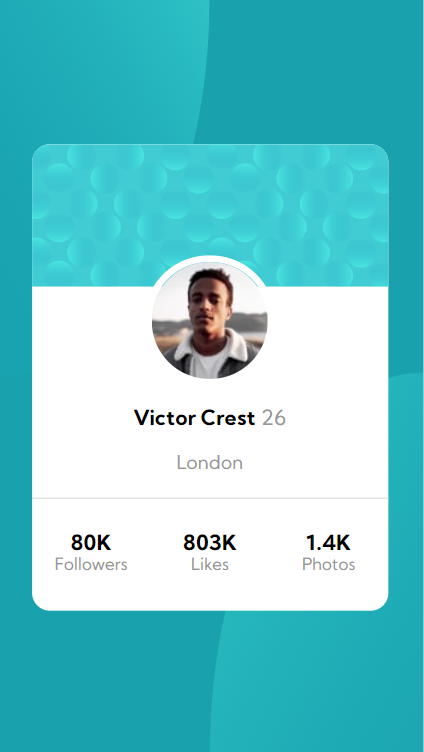

# Frontend Mentor - Profile card component solution

This is a solution to the [Profile card component challenge on Frontend Mentor](https://www.frontendmentor.io/challenges/profile-card-component-cfArpWshJ).

## Table of contents

- [Overview](#overview)
  - [The challenge](#the-challenge)
  - [Screenshot](#screenshot)
  - [Links](#links)
- [My process](#my-process)
  - [Built with](#built-with)
  - [What I learned](#what-i-learned)
  - [Continued development](#continued-development)
- [Author](#author)

## Overview

### The challenge

- Build out the project to the designs provided

### Screenshot

**Mobile**

**Desktop**

### Links

- Solution URL: [https://github.com/OrlandoVC/profile-card-component](https://github.com/OrlandoVC/profile-card-component)
- Live Site URL: [https://OrlandoVC.github.io/profile-card-component](https://OrlandoVC.github.io/profile-card-component)

## My process

### Built with

- Semantic HTML5 markup
- CSS custom properties
- Flexbox
- CSS Grid
- Mobile-first workflow

### What I learned

With this project I put into practice my learning about CSS grid and how to work easier with this technology.

### Continued development

To improve my development skills I will focus on studying concepts such as:

- CSS Grid
- CSS Flexbox
- BEM
- Atomic Desing
- Responsive Design

## Author

- Website - [kelaud.com](https://www.kelaud.com)
- Frontend Mentor - [@OrlandoVC](https://www.frontendmentor.io/profile/OrlandoVC)
- Twitter - [@Orli_ando](https://www.twitter.com/Orli_ando)
